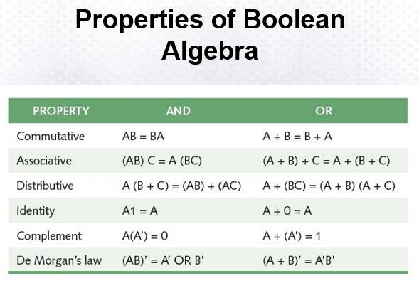

# DISCRETE STRUCTURES 1 | Recap
- Tree
- Graph
- Induction
- permutations
- Network model

prems algorithim
pruscal algorithim

we compute then we apply exercises

https://web.stanford.edu/class/cs103x/cs103x-notes.pdf

 matrix in the program wnat ni sir
 can be solve in manual so can exam with pencil and paper

program side output
solve the topic using manual method u translate the manual to a program na (gawa mo)

midterm and final; exam included on the activites (sa mga outputs nagagawin natin)

all algorithim ouput lang

disscuss the solution sa atin
probably with groups 2 or 3 mins

examinations will fucos on programing natin :)

permutations
combination
peguin hold prensiple

para sa mga probabilistic

next meeting clase
