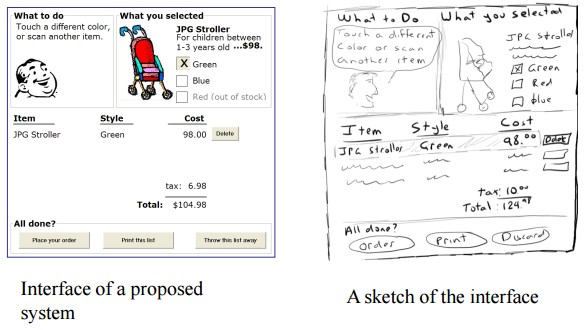

https://www.spiceworks.com/tech/artificial-intelligence/articles/what-is-hci/
## Summary 
### The Rise of HCI 
- 1980's
- Apple introduced the Macintosh in 1984
- much more accessible
- making communication simpler
- designing, implementing, and evaluating interactive interfaces

## HCI begans 
- video game 
- word processors
- numerical units

## Key components of HCI
- User
- Goal-oriented task
- Interface
- Context

## Importance of HCI
  1. HCI in daily lives
  2. Industry
  3. Accessible to disabled
  4. An integral part of software success
  5. Useful for untrained communities

## Examples of HCI
  1. IoT technology
  2. Eye-tracking technology
  3. Speech recognition technology
  4. AR/VR technology
  5. Cloud computing
  
## Goals of HCI
### Usability
- How to use it
- Safe
- Efficient
- Effective
- Utility
- Enjoyable

### User Experience
- Disable Traits
- Undesirable Traits

# What Is HCI (Human-Computer Interaction)? Meaning, Importance, Examples, and Goals
Human-computer interaction (HCI) targets the design and implementation of interactive technology.

Human-computer interaction (HCI) is defined as the field of study that focuses on optimizing how users and computers interact by designing interactive computer interfaces that satisfy users’ needs. This article explains the fundamentals of HCI, its goals, importance, and examples.

## What Is HCI?
Human-computer interaction (HCI) is the field of study that focuses on optimizing how users and computers interact by designing interactive computer interfaces that __satisfy users’__ needs. It is a multidisciplinary subject covering computer science, behavioral sciences, cognitive science, ergonomics, psychology, and design principles.

The emergence of HCI dates back to the 1980s, when personal computing was on the rise. It was when desktop computers started appearing in households and corporate offices. HCI’s journey began with video games, word processors, and numerical units.

However, with the advent of the internet and the explosion of mobile and diversified technologies such as voice-based and Internet of Things (IoT), computing became omnipresent and omnipotent. Technological competence further led to the evolution of user interactions. Consequently, the need for developing a tool that would make such man-machine interactions more human-like grew significantly. This established HCI as a technology, bringing different fields such as cognitive engineering, linguistics, neuroscience, and others under its realm.

Today, HCI focuses on designing, implementing, and evaluating interactive interfaces that enhance user experience using computing devices. This includes user interface design, user-centered design, and user experience design.

Human Computer Interaction (HCI) – to satisfy users, mainly designs and interface. How easy your program is and how appealing it is to the user.
__User Interface (UI)__ – aesthetic, colors, buttons, and designs.
__User Experience (UX)__ – how the user feels about your program, user’s satisfaction, and user’s interaction to your program from first to last.

## Importance of HCI
HCI is crucial in designing intuitive interfaces that people with different abilities and expertise usually access. Most importantly, human-computer interaction is helpful for communities lacking knowledge and formal training on interacting with specific computing systems.

With efficient HCI designs, users need not consider the intricacies and complexities of using the computing system. User-friendly interfaces ensure that user interactions are clear, precise, and natural.

Let’s understand the importance of HCI in our day-to-day lives:

### 1. HCI in daily lives
Today, technology has penetrated our routine lives and has impacted our daily activities. To experience HCI technology, one need not own or use a smartphone or computer. When people use an ATM, food dispensing machine, or snack vending machine, they inevitably come in contact with HCI. This is because HCI plays a vital role in designing the interfaces of such systems that make them usable and efficient.

### 2. Industry
Industries that use computing technology for day-to-day activities tend to consider HCI a necessary business-driving force. Efficiently designed systems ensure that employees are comfortable using the systems for their everyday work. With HCI, systems are easy to handle, even for untrained staff.

HCI is critical for designing safety systems such as those used in air traffic control (ATC) or power plants. The aim of HCI, in such cases, is to make sure that the system is accessible to any non-expert individual who can handle safety-critical situations if the need arises.

### 3. Accessible to disabled
The primary objective of HCI is to design systems that make them accessible, usable, efficient, and safe for anyone and everyone. This implies that people with a wide range of capabilities, expertise, and knowledge can easily use HCI-designed systems. It also encompasses people with disabilities. HCI tends to rely on user-centered techniques and methods to make systems usable for people with disabilities.

### 4. An integral part of software success
HCI is an integral part of software development companies that develop software for end-users. Such companies use HCI techniques to develop software products to make them usable. Since the product is finally consumed by the end-user, following HCI methods is crucial as the product’s sales depend on its usability.

### 5. Useful for untrained communities
Today, user manuals for general computer systems are a rarity. Very few advanced and complex computing systems provide user manuals. In general, users expect the systems to be user-friendly and enable them to access the system within a few minutes of interacting with it. Here, HCI is an effective tool that designers can use to design easy-to-use interfaces. HCI principles also ensure that the systems have obvious interfaces and do not require special training to be used. Hence, HCI makes computing systems suitable for an untrained community.

## Key components of HCI
Fundamentally, HCI is made up of four key components:

### 1. __The user__
The user component refers to an individual or a group of individuals that participate in a common task. HCI studies users’ needs, goals, and interaction patterns. It analyzes various parameters such as users’ cognitive capabilities, emotions, and experiences to provide them with a seamless experience while interacting with computing systems.

### 2. __The goal-oriented task__
A user operates a computer system with an objective or goal in mind. The computer provides a digital representation of objects to accomplish this goal. For example, booking an airline for a destination could be a task for an aviation website. In such goal-oriented scenarios, one should consider the following aspects for a better user experience:

- The complexity of the task that the user intends to accomplish
- Knowledge and skills necessary to interact with the digital object
- Time required to carry out the task

### 3. __The interface__
The interface is a crucial HCI component that can enhance the overall user interaction experience. Various interface-related aspects must be considered, such as interaction type (touch, click, gesture, or voice), screen resolution, display size, or even color contrast. Users can adjust these depending on the user’s needs and requirements.

For example, consider a user visiting a website on a smartphone. In such a case, the mobile version of the website should only display important information that allows the user to navigate through the site easily. Moreover, the text size should be appropriately adjusted so that the user is in a position to read it on the mobile device. Such design optimization boosts user experience as it makes them feel comfortable while accessing the site on a mobile phone.

### 4. __The context__
HCI is not only about providing better communication between users and computers but also about factoring in the context and environment in which the system is accessed. For example, while designing a smartphone app, designers need to evaluate how the app will visually appear in different lighting conditions (during day or night) or how it will perform when there is a poor network connection. Such aspects can have a significant impact on the end-user experience.

Thus, HCI is a result of continuous testing and refinement of interface designs that can affect the context of use for the users.

## Examples of HCI
  1. __IoT technology__
  2. __Eye-tracking technology__
  3. __Speech recognition technology__
  4. __AR/VR technology__
  5. __Cloud computing__

## Goals of HCI
The principal objective of HCI is to develop functional systems that are usable, safe, and efficient for end-users. The developer community can achieve this goal by fulfilling the following criteria:

- Have sound knowledge of how users use computing systems
- Design methods, techniques, and tools that allow users to access systems based on their needs
- Adjust, test, refine, validate, and ensure that users achieve effective communication or interaction with the systems
- Always give priority to end-users and lay the robust foundation of HCI

To realize the above points, developers must focus on two relevant areas: __usability__ and __user experience__. Let’s look at each category in detail:

1. __Usability__
    
    Usability is key to HCI as it ensures that users of all types can quickly learn and use computing systems. A practical and usable HCI system has the following characteristics:

    - __How to use it__: This should be easy to learn and remember for new and infrequent users to learn and remember. For example, operating systems with a user-friendly interface are easier to understand than DOS operating systems that use a command-line interface.
    - __Safe__: A safe system safeguards users from undesirable and dangerous situations. This may refer to users making mistakes and errors while using the system that may lead to severe consequences. Users can resolve this through HCI practices. For example, systems can be designed to prevent users from activating specific keys or buttons accidentally. Another example could be to provide recovery plans once the user commits mistakes. This may give users the confidence to explore the system or interface further.
    - __Efficient__: An efficient system defines how good the system is and whether it accomplishes the tasks that it is supposed to. Moreover, it illustrates how the system provides the necessary support to users to complete their tasks.
    - __Effective__: A practical system provides high-quality performance. It describes whether the system can achieve the desired goals.
    - __Utility__: Utility refers to the various functionalities and tools provided by the system to complete the intended task. For example, a sound utility system offers an integrated development environment (IDE) that provides intermittent help to programmers or users through suggestions.
    - __Enjoyable__: Users find the computing system enjoyable to use when the interface is less complex to interpret and understand.

2. __User experience__

    User experience is a subjective trait that focuses on how users feel about the computing system when interacting with it. Here, user feelings are studied individually so that developers and support teams can target particular users to evoke positive feelings while using the system.

    HCI systems classify user interaction patterns into the following categories and further refine the system based on the detected pattern:

    - __Desirable traits__ – satisfying, enjoyable, motivating, or surprising
    - __Undesirable traits__ – Frustrating, unpleasant, or annoying

# Interactive System Design
https://www.google.com/url?sa=t&rct=j&q=&esrc=s&source=web&cd=&ved=2ahUKEwiS-_GHws-EAxXDxTgGHYdGCKgQFnoECBgQAQ&url=https%3A%2F%2Fhci-lecture.de%2FHCI%2Ftopics%2Fintro%2F02-TermiBasics%2FtermiBasics20200413.pptx&usg=AOvVaw1trjs2t2uIsMBBxMwRPEn8&opi=89978449
## Interactive Systems
### Definition and Examples
- An __Interactive System__ is a computational system that allows users to interact in real-time. Interactions receive instant feedback visible to the user.
- Interactive computing is used in a similar way, with a focus that is less on the systems aspect. 

__Examples__
- __Graphical user interfaces__, such as Windows 10 or MacOS
- __Mobile devices__, such as an Android phone 
gaming consoles, such as Xbox with Kinect or Nintendo Switch 
- __Ticket vending machines__, such as the DB-ticket machine  
- __Command line interfaces__, such as an SSH console 

https://www.tutorialspoint.com/human_computer_interface/interactive_system_design.htm

## Concept of Usability Engineering
__Usability Engineering__ is a method in the progress of software and systems, which includes user contribution from the inception of the process and assures the effectiveness of the product through the use of a usability requirement and metrics.

    It thus refers to the Usability Function features of the entire process of abstracting, implementing & testing hardware and software products. Requirements gathering stage to installation, marketing and testing of products, all fall in this process.

### Goals of Usability Engineering
- __Effective to use__ − Functional
- __Efficient to use__ − Efficient
- __Error free in use__ − Safe
- __Easy to use__ − Friendly
- __Enjoyable in use__ − Delightful Experience

### Usability
__Usability has three components__ − effectiveness, efficiency and satisfaction, using which, users accomplish their goals in particular environments. Let us look in brief about these components.
- __Effectiveness__ − The completeness with which users achieve their goals.
- __Efficiency__ − The competence used in using the resources to effectively achieve the goals.
- __Satisfaction__ − The ease of the work system to its users.

## Usability Study
The methodical study on the interaction between people, products, and environment based on experimental assessment. 
_Example: Psychology, Behavioral Science, etc._

- __Usability Testing__
The scientific evaluation of the stated usability parameters as per the user’s requirements, competences, prospects, safety and satisfaction is known as usability testing.

- __Acceptance Testing__
Acceptance testing also known as User Acceptance Testing (UAT), is a testing procedure that is performed by the users as a final checkpoint before signing off from a vendor. Let us take an example of the handheld barcode scanner.

```Let us assume that a supermarket has bought barcode scanners from a vendor. The supermarket gathers a team of counter employees and make them test the device in a mock store setting. By this procedure, the users would determine if the product is acceptable for their needs. It is required that the user acceptance testing "pass" before they receive the final product from the vendor.```

https://www.usability.gov/how-to-and-tools/methods/usability-testing.html

__To run an effective usability test__, __you need to develop a solid test plan__, __recruit participants__, and then __analyze and report your findings__.

## Benefits of Usability Testing
_Usability testing lets the design and development teams identify problems before they are coded. The earlier issues are identified and fixed, the less expensive the fixes will be in terms of both staff time and possible impact to the schedule.  During a usability test, you will:_
- Learn if participants are able to complete specified tasks successfully and
- Identify how long it takes to complete specified tasks
- Find out how satisfied participants are with your Web site or other product
- Identify changes required to improve user performance and satisfaction
- And analyze the performance to see if it meets your usability objectives

https://www.inrhythm.com/guide-to-integration-testing/

system now is perform

## Each Testing Level Details
__Unit testing:__ > Proposal, Languge, Flowchart, Algorithims, IDE etc to make the program
A Unit is a smallest testable portion of system or application which can be compiled, liked, loaded, and executed. This kind of testing helps to test each module separately.

The aim is to test each part of the software by separating it. It checks that component are fulfilling functionalities or not. This kind of testing is performed by developers.

__Integration testing:__
Integration means combining. For Example, In this testing phase, different software modules are combined and tested as a group to make sure that integrated system is ready for system testing.

Integrating testing checks the data flow from one module to other modules. This kind of testing is performed by testers.

__System Testing:__
System testing is performed on a complete, integrated system. It allows checking system’s compliance as per the requirements. It tests the overall interaction of components. It involves load, performance, reliability and security testing.

System testing most often the final test to verify that the system meets the specification. It evaluates both functional and non-functional need for the testing.

__Acceptance testing:__ > Checking on prof > gets grade
Acceptance testing is a test conducted to find if the requirements of a specification or contract are met as per its delivery. Acceptance testing is basically done by the user or customer. However, other stockholders can be involved in this process.
during development on systems 

https://www.tutorialspoint.com/human_computer_interface/interactive_system_design.htm
## Software Tools
A software tool is a programmatic software used to create, maintain, or otherwise support other programs and applications. Some of the commonly used software tools in HCI are as follows −

- __Specification Methods__ − The methods used to specify the GUI. Even though these are lengthy and ambiguous methods, they are easy to understand.

- __Grammars__ − Written Instructions or Expressions that a program would understand. They provide confirmations for completeness and correctness.

- __Transition Diagram__ − Set of nodes and links that can be displayed in text, link frequency, state diagram, etc. They are difficult in evaluating usability, visibility, modularity and synchronization.

- __Statecharts__ − Chart methods developed for simultaneous user activities and external actions. They provide link-specification with interface building tools.

- __Interface Building Tools__ − Design methods that help in designing command languages, data-entry structures, and widgets.

- __Interface Mockup Tools__ − Tools to develop a quick sketch of GUI. E.g., Microsoft Visio, Visual Studio .Net, etc.

- __Software Engineering Tools__ − Extensive programming tools to provide user interface management system.

- __Evaluation Tools__ − Tools to evaluate the correctness and completeness of programs.

## HCI and Software Engineering
Software engineering is the study of designing, development and preservation of software. It comes in contact with HCI to make the man and machine interaction more vibrant and interactive.

Let us see the following model in software engineering for interactive designing.

### The Waterfall Method

### Interactive System Design

The uni-directional movement of the waterfall model of Software Engineering shows that every phase depends on the preceding phase and not vice-versa. However, this model is not suitable for the interactive system design.

The interactive system design shows that every phase depends on each other to serve the purpose of designing and product creation. It is a continuous process as there is so much to know and users keep changing all the time. An interactive system designer should recognize this diversity.

## Prototyping
Prototyping is another type of software engineering models that can have a complete range of functionalities of the projected system.

In HCI, prototyping is a trial and partial design that helps users in testing design ideas without executing a complete system.

Example of a prototype can be Sketches. Sketches of interactive design can later be produced into graphical interface. See the following diagram.


### 3 types of Prototyping
- __Low Fidelity Prototype__
- __Medium Fidelity Prototype__
- __Hi Fidelity Prototype__

The above diagram can be considered as a __Low Fidelity Prototype__ as it uses manual procedures like sketching in a paper.

A __Medium Fidelity Prototype__ involves some but not all procedures of the system. E.g., first screen of a GUI.

Finally, a __Hi Fidelity Prototype__ simulates all the functionalities of the system in a design. This prototype requires, time, money and work force.

- __ORAL MIDTERM EXAMINATION
SECOND WEEK MARCH__